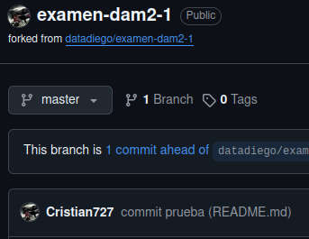
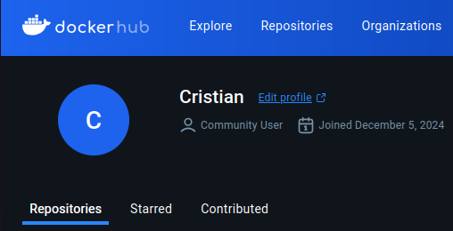

Sprint 1: Preparación

1º Instalamos sudo apt install apache2

2º Compruebo que puedo hacer un commit correctamente a mi Repositorio



3º Comprobamos que tenco mi cuenta de Docker iniciada



### Sprint 1: Preparación

1. **Comprobación de commit y push a GitHub**:
   - Realicé un commit y push a mi repositorio con los siguientes comandos:
     ```bash
     git add .
     git commit -m "Primer commit"
     git push origin main
     ```
   - Verifiqué que los cambios se subieron correctamente a mi repositorio en GitHub.

2. **Inicio de sesión en Docker Hub**:
   - Inicié sesión en Docker Hub con:
     ```bash
     docker login
     ```

3. **Verificación del estado de los contenedores Docker**:
   - Comprobé que no había contenedores en ejecución con el comando:
     ```bash
     docker ps
     ```
   - El resultado fue:
     ```bash
     CONTAINER ID   IMAGE     COMMAND   CREATED   STATUS    PORTS     NAMES
     ```

4. **Creación del servidor Apache con Docker**:
   - Creé una carpeta llamada `apache` y dentro de ella, los archivos `Dockerfile` e `index.html`.
   - El contenido del `Dockerfile` es el siguiente:
     ```dockerfile
     FROM httpd:2.4
     COPY index.html /usr/local/apache2/htdocs/
     ```
   - El archivo `index.html` contiene una simple página HTML con el mensaje "Hola Mundo".
   - Construí la imagen Docker con:
     ```bash
     docker build -t apache-server .
     ```
   - Ejecué el contenedor en segundo plano con:
     ```bash
     docker run -d -p 8080:80 apache-server
     ```
   - Verifiqué que el contenedor estaba en ejecución con:
     ```bash
     docker ps
     ```
   - El contenedor estaba en ejecución y el servidor Apache estaba sirviendo la página en `http://localhost:8080`.

## Sprint 3: Apache + PHP

### Objetivo del Sprint 3

En este sprint, hemos configurado un servidor web Apache que ejecuta PHP. El servidor muestra una página que incluye un mensaje de "Hola Mundo", la fecha y hora actual, la versión de PHP y Apache, la IP del servidor y la IP del cliente.

### Pasos realizados

1. **Copiar la carpeta `apache` y renombrarla a `apache-php`**:
   - Copié la carpeta `apache` del Sprint 2 a `apache-php` para seguir trabajando en ella.
   - Usé el siguiente comando para copiar la carpeta:
     ```bash
     cp -r apache apache-php
     ```

2. **Modificación del `Dockerfile`**:
   - En el archivo `Dockerfile`, cambié la imagen base a `php:7.4-apache`, que incluye Apache y PHP.
   - Instalé la extensión `mysqli` de PHP para permitir la conexión a bases de datos MySQL.
   - Copié el archivo `index.php` al directorio adecuado dentro del contenedor Apache.
   - Aquí está el contenido modificado del `Dockerfile`:
     ```dockerfile
     # Usa una imagen base que tenga Apache y PHP
     FROM php:7.4-apache

     # Habilita los módulos necesarios para que Apache pueda manejar PHP
     RUN docker-php-ext-install mysqli

     # Copia el archivo index.php al directorio de Apache
     COPY index.php /var/www/html/

     # Expone el puerto 80
     EXPOSE 80
     ```

3. **Creación del archivo `index.php`**:
   - Creé un archivo PHP (`index.php`) con el siguiente contenido para mostrar información relevante:
     - Un mensaje de "Hola Mundo desde PHP".
     - La fecha y hora actual usando la función `date()`.
     - La versión de PHP con `phpversion()`.
     - La versión de Apache con `apache_get_version()`.
     - La IP del servidor con `getHostByName(getHostName())`.
     - La IP del cliente con `$_SERVER['REMOTE_ADDR']`.
   
   El contenido del archivo `index.php` es el siguiente:
   ```php
   <?php
   // Mostrar un mensaje de Hola Mundo
   echo "<h1>Hola Mundo desde PHP!</h1>";

   // Mostrar la fecha y hora actual
   echo "<p>Fecha y hora actual: " . date('Y-m-d H:i:s') . "</p>";

   // Mostrar la versión de PHP
   echo "<p>Versión de PHP: " . phpversion() . "</p>";

   // Mostrar la versión de Apache
   echo "<p>Versión de Apache: " . apache_get_version() . "</p>";

   // Mostrar la IP del servidor
   echo "<p>IP del servidor: " . getHostByName(getHostName()) . "</p>";

   // Mostrar la IP del cliente
   echo "<p>IP del cliente: " . $_SERVER['REMOTE_ADDR'] . "</p>";
   ?>
